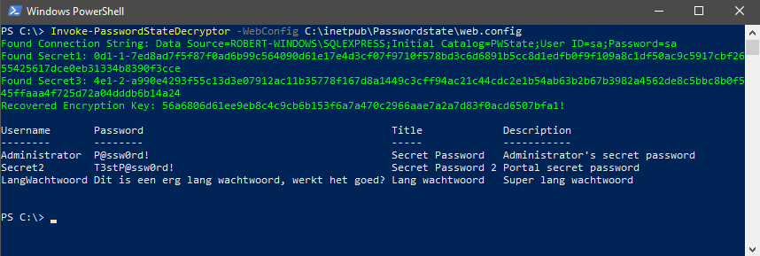
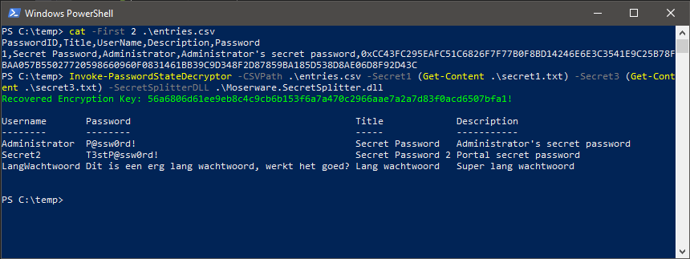

<p align="center">
<h1>Passwordstate decryptor</h1>
    <b>Passwordstate decryptor is a PowerShell script for decrypting <a href="https://www.clickstudios.com.au/">Passwordstate</a> entries.</a>.</b>
    <br/>
    <a href="#usage">Usage</a>
    •
    <a href="#examples">Examples</a>
    •
    <a href="#issues">Issues</a>
    •
    <a href="#information">Information</a>
    <br/>
    <sub>Built with ❤ by the <a href="https://twitter.com/northwave_sec">Northwave</a> Red Team</sub>
    <br/>
</p>
<hr>

## Usage

Please check the [known issues](#issues) before your start.

1. Import the PasswordStateDecryptor module.
    - `Import-Module .\PasswordStateDecryptor.ps1`
2. Point the script towards the web.config file.
    - `Invoke-PasswordStateDecryptor -WebConfig 'C:\inetpub\PasswordState\web.config'`
3. Watch the script get and decrypt all password entries!

**All options**

```
NAME
    Invoke-PasswordStateDecryptor

SYNOPSIS
    Connects to a PasswordState database and extracts all passwords from
    a non-FIPS installation of PasswordState. Optionally allows offline
    decryption by giving in the secrets. For more information read the
    accompanied blog or the source code.

    Author: Robert Diepeveen (robert.diepeveen@northwave.nl)
    License: BSD 3-Clause
    Required Dependencies: None
    Optional Dependencies: None


SYNTAX
    Invoke-PasswordStateDecryptor [[-WebConfig] <String>] [[-SecretSplitterDLL] <String>] [[-FIPSMode] <Boolean>]
    [[-ConnectionString] <String>] [[-Secret1] <String>] [[-Secret3] <String>] [[-CSVPath] <String>] [[-EncryptionKey]
    <String>] [<CommonParameters>]


DESCRIPTION
    Invoke-PasswordStateDecryptor will connect to the database, extract all of
    the information necessary to derive the encryption key, decrypt and return the
    plaintext passwords for all entries in the database.
    This script is intended to be run on a host that has all of the following:
        * SQLServer database server with PasswordState database
        * web.config from the original compromised PasswordState server
        * Moserware.SecretSplitter.dll somewhere (shipped in the repo or on the disk)
    An example of such a host is the PasswordState server itself.

    Alternatively, if you are able to compromise the database, export all entries to CSV
    and the secret1 and secret3 or the encryption key, you can use the script offline. The
    CSV should contain (at least) the following fields: UserName, Password, Description and Title


RELATED LINKS

REMARKS
    To see the examples, type: "get-help Invoke-PasswordStateDecryptor -examples".
    For more information, type: "get-help Invoke-PasswordStateDecryptor -detailed".
    For technical information, type: "get-help Invoke-PasswordStateDecryptor -full".
```

## Examples




## Issues

Issues or new features can be reported via the [GitHub issue tracker](https://github.com/NorthwaveNL/passwordstate-decryptor/issues). Please make sure your issue or feature has not yet been reported by anyone else before submitting a new one.

## Information
The full decryption process is explained on the [More info](MORE_INFO.md) page.